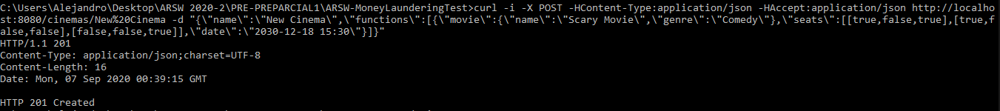
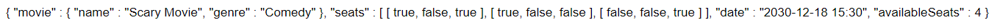
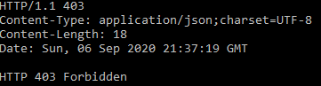
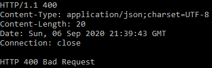

# Arquitecturas de Software
# Laboratorio 4 Componentes y conectores Middleware - Gestión de reservas de boletas de cine.

## Integrantes
- David Alejandro Vasquez Carreño
- Michael Jefferson Ballesteros Coca

____________
#### Instalación

Vamos a compilar el código con maven.
   ```console
mvn compile
   ```


Para ejecutar el programa.

  ```console
mvn exec:java -Dexec.mainClass="edu.eci.arsw.cinema.CinemaAPIApplication"
   ```

Para ejecutar las pruebas

  ```console
mvn test
   ```

Resultados:


____________

## Construyendo peticiones POST

La petición POST es generalmente usada para hacer peticiones que hagan cambios en el servidor.
En nuestro caso de estudio, al hacer la petición, vamos a realizar la creación de un recurso cinema.

La petición llegaría con el URI ***/cinemas/{name}***.
El formato json de la petición se indica abajo.


```json5
{
  "name": "New Cinema",
  "functions": [
    {
      "movie": {
        "name": "Scary Movie",
        "genre": "Comedy"
      },
      "seats": [
        [
          true,
          false,
          true
        ],
        [
          true,
          false,
          false
        ],
        [
          false,
          false,
          true
        ]
      ],
      "date": "2030-12-18 15:30"
    }
  ]
}
```

Enviamos la peticón POST por medio del comando __curl__ de consola.



Vemos una respuesta exitosa por parte del servidor, por lo que pasamos a consultar que el recurso haya sido guardado.

Consultamos el cinema y película con la URL.




Para consultar nivel de maduración 2, vamos a insertar nuevamente el recurso.

 

Si el formato json no está bien formado(Campos inconsistentes o que no existen en el mapeo del objeto cinema):



## Contribuciones

* **Alejandro Vasquez** - *Extender* - [alejovasquero](https://github.com/alejovasquero)
* **Michael Ballesteros** - *Extender* - [Wasawsky](https://github.com/Wasawsky)

