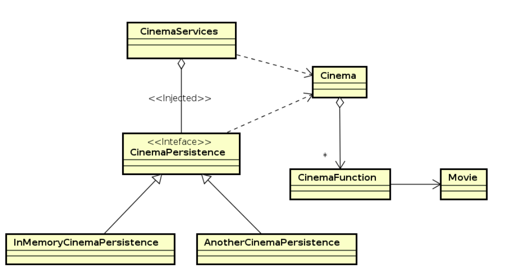

### Escuela Colombiana de Ingeniería

### Arquitecturas de Software

## Laboratorio Componentes y conectores Middleware - Gestión de reservas de boletas de cine.

### Dependencias
* [Ejercicio introductorio al manejo de Spring y la configuración basada en anotaciones](https://github.com/ARSW-ECI/Spring_LightweightCont_Annotation-DI_Example).

### Descripción

En este ejercicio se va a construír un modelo de clases para la capa lógica de una aplicación que permita gestionar la venta de entradas de cine para una prestigiosa compañía. 

### Parte I

1. Configure la aplicación para que funcione bajo un esquema de inyección de dependencias, tal como se muestra en el diagrama anterior.
	Lo anterior requiere:

	* Agregar las dependencias de Spring.
	* Agregar la configuración de Spring.
	* Configurar la aplicación -mediante anotaciones- para que el esquema de persistencia sea inyectado al momento de ser creado el bean 'CinemaServices'.

2. Complete los operaciones getCinemaByName(), buyTicket() y getFunctionsbyCinemaAndDate(). Implemente todo lo requerido de las capas inferiores (por ahora, el esquema de persistencia disponible 'InMemoryCinemasPersistence') agregando las pruebas correspondientes en 'InMemoryPersistenceTest'.

3. Para posteriores consultas se quieren implementar dos funcionalidades:
- Un método 'getFunctionsbyCinemaAndDate' que permita obtener todas las funciones de un determinado cine para una determinada fecha.
- Permitir la compra o reserva de boletos para una determinada posición de sillas en la sala a través del método 'buyTicket'.

4. Haga un programa en el que cree (mediante Spring) una instancia de CinemaServices, y rectifique la funcionalidad del mismo: registrar cines, consultar cines, obtener las funciones de determinado cine, comprar/reservar boletas, etc.

5. Se quiere que las consultas realicen un proceso de filtrado de las películas a exhibir, dichos filtros buscan darle la facilidad al usuario de ver las películas más aduecuadas de acuerdo a su necesidad.
Ajuste la aplicación (agregando las abstracciones e implementaciones que considere) para que a la clase CinemaServices se le inyecte uno de dos posibles 'filtros' (o eventuales futuros filtros). No se contempla el uso de más de uno a la vez:
	* (A) Filtrado por género: Permite obtener sólo la lista de las películas de un determinado género (de un determinado cine y una determinada fecha) (El género entra por parámetro).
	* (B) Filtrado por disponibilidad :  Permite obtener sólo la lista de las películas que tienen más de x asientos vacíos (de un determinado cine y una determinada fecha) (La cantidad de asientos entra por parámetro).

5. Agregue las pruebas correspondientes a cada uno de estos filtros, y pruebe su funcionamiento en el programa de prueba, comprobando que sólo cambiando la posición de las anotaciones -sin cambiar nada más-, el programa retorne el listado de películas filtradas de la manera (A) o de la manera (B).
